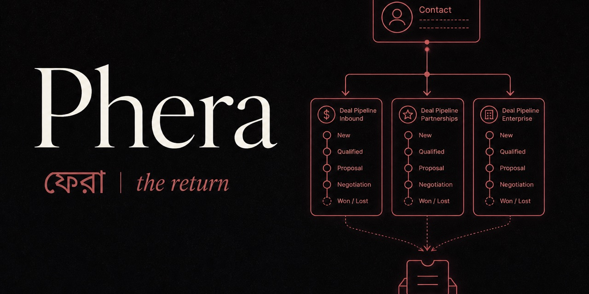
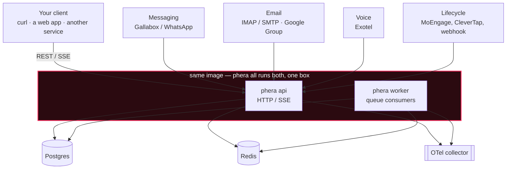
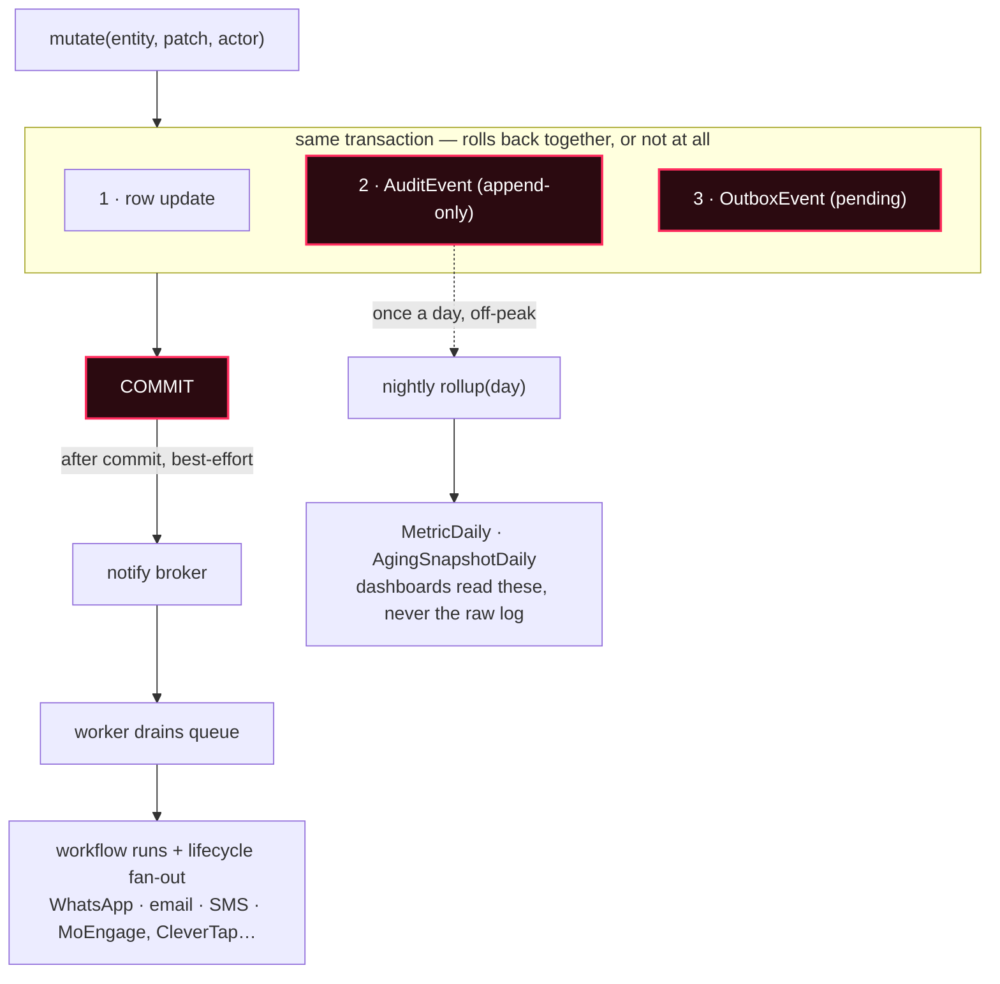

<p align="center">
  
</p>

<h1 align="center">Phera</h1>
<p align="center"><strong>ফেরা — the return.</strong></p>
<p align="center">
  A <strong>headless CRM</strong> you run yourself: configurable pipelines, an omnichannel
  support inbox, event-driven workflows, and an audit trail that doubles as analytics.
  No product UI ships in the box — bring your own client, or drive it from a script.
</p>

<p align="center">
  <a href="https://debarko.de/products/phera">Walkthrough</a>
  ·
  <a href="https://github.com/debarko/phera/blob/main/CHANNELS.md">Channels</a>
  ·
  <a href="#quick-start">Quick start</a>
  ·
  <a href="LICENSE">License</a>
</p>

<p align="center">
  <a href="https://github.com/debarko/phera/actions/workflows/ci.yml"></a>
  <a href="https://github.com/debarko/phera/stargazers"></a>
  <a href="https://www.python.org/"></a>
  <a href="https://fastapi.tiangolo.com/"></a>
  <a href="https://www.postgresql.org/"></a>
  <a href="LICENSE"></a>
  <a href="https://coderabbit.ai"></a>
</p>

---

## Why a headless CRM

A CRM is **infrastructure**, not a seat. Most teams already have operational software and still no relationship layer: a lead table scoped to one channel, no support ticketing, and a customer's calls, tickets, and deals scattered across tables with nothing tying them together.

The deeper problem: **one person is not one journey.** The same contact can fill three forms over three months — each a different commercial motion, run by a different team. Collapsing that onto a single "lead status" field loses two of the three journeys.

Phera keeps the person (`Contact`) and the journey (`Deal` in a `Pipeline`) as separate records from day one. A contact can sit in many funnels at once.

| Principle | What it means |
|---|---|
| **Vertical-agnostic core** | No hospital, e-commerce, or SaaS vocabulary in the domain model. Map *your* vertical onto Contact / Pipeline / Deal. |
| **Config over code** | Funnels, stages, ownership rules, and workflows are data. Adding one is an admin screen, not a pull request. |
| **Pluggable everything** | WhatsApp, email, voice, and lifecycle/CDP providers sit behind interfaces. The core never imports a vendor SDK. |
| **Audit trail as analytics** | Every mutation writes its own history. A nightly job folds it into daily metrics. No warehouse, no CDC stream. |

## What's in the box

- **Configurable funnels** — pipelines and stages are admin-owned; create, clone, reorder without a deploy.
- **Omnichannel inbox** — WhatsApp, email, and phone normalize into one ticket. One routing engine, one capacity pool, L1 → L2 overflow.
- **Workflow engine** — n8n-style graphs on domain events and time-based waits, run on horizontally scaled workers.
- **Voice** — Exotel inbound routing, per-agent SIP identities, call lifecycle, recording, and transcription on the contact timeline.
- **Ownership** — contact-centric or pipeline-centric. A workspace setting, not a fork.
- **Teams** — membership and pipeline visibility so records can be scoped to a team, not only an individual owner.

## Built for one vertical at a time — by config

The core has no industry baked in. These are shapes the same Contact / Pipeline / Deal model already fits:

| Vertical | The "one person, many journeys" problem |
|---|---|
| **Real estate** | A buyer renting, resale-hunting, and pre-approving new construction — without three lead statuses fighting each other. |
| **Home services** | Roof quote, then gutter cleaning two months later — same address, before a second truck rolls. |
| **Insurance** | Auto, home, and life as three policies and one relationship — plus an audit trail compliance already wants. |
| **Legal** | Two matters, two practice groups, one immutable file of every deadline and touch. |
| **Retail** | A wholesale account and a loyalty-program shopper turn out to be the same person. |

## Architecture — same binary, two roles

One image, two commands. `phera api` serves HTTP; `phera worker` drains queues; `phera all` runs both on a laptop. Scaling out is more boxes of the same image, never a new microservice. Adapters — messaging, email, voice, lifecycle — are the only thing that changes per deployment.



**Stack:** FastAPI · SQLAlchemy (async) · Postgres · Redis · Alembic · OpenTelemetry · Typer CLI · Docker

## Every mutation writes its own history

All writes go through one helper. It updates the row, appends an immutable `AuditEvent` and an `OutboxEvent` in the **same transaction**, then commits. Nothing is lost if Redis is briefly down — the broker is notified only after commit, and a dispatcher heals any miss. A nightly job folds the log into small daily tables, so aging and TAT numbers come from the same database, not a warehouse.



## Domain model

| Entity | What it is |
|---|---|
| `Contact` | A person. The unified-timeline anchor — not a lead. |
| `Pipeline` | A funnel: named, ordered stages. Admins create these; no deploy. |
| `Stage` | One step in a pipeline — open, won, or lost, with an optional SLA. |
| `Deal` | One contact's membership in one pipeline. **This** is the lead. |
| `Ticket` | A support request. One inbox regardless of channel. |
| `Team` | A group of agents. Pipelines can be granted to teams for visibility. |
| `Interaction` | Append-only row behind the contact-facing timeline. |
| `AuditEvent` | Immutable record of every mutation — who, what, when, from → to. |
| `Workflow` | A published graph: trigger → conditions → wait/branch → actions. |

Stage lives on the `Deal`, never on the `Contact`. There is no `Contact.stage` — only a list of deals, each with its own owner and position.

## Quick start

```bash
git clone https://github.com/debarko/phera.git
cd phera

docker compose up -d postgres redis otel-collector
pip install -e ".[dev]"
cp .env.example .env
alembic upgrade head
phera all
```

| | URL |
|---|---|
| API docs | http://localhost:8010/docs |
| Health | http://localhost:8010/health |

Auth is `X-Actor-*` headers only — no JWT in the service. WhatsApp (Gallabox) and email setup: [CHANNELS.md](CHANNELS.md).

## Process roles

| Command | Role |
|---|---|
| `phera api` | HTTP only |
| `phera worker` | Queue consumers |
| `phera all` | API + worker (local dev) |

## Observability

Set `OTEL_EXPORTER_OTLP_ENDPOINT=http://localhost:4318` (default). Traces, metrics, and slow SQL export via OTLP HTTP to any compatible backend (SigNoz, Grafana, Honeycomb, …).

## Testing

Tests split into **unit** (no database) and **integration** (ephemeral in-memory SQLite, created and destroyed per test). No Docker, Postgres, or Redis required for CI.

| Command | What it runs |
|---|---|
| `make test` | Unit tests only (default) |
| `make test-integration` | Flow tests with ephemeral SQLite |
| `make test-nightly` | Full suite — unit + integration |
| `make test-cov` | Full suite with coverage report |

```bash
make test              # fast, no DB
make test-nightly      # exhaustive regression suite
```

```bash
OTEL_ENABLED=0 REDIS_URL=
```

## Contributing

Issues and pull requests are welcome. Read the code, open an issue, send a PR. Run `make test` before you push — CI runs the same suite on every PR.

## License

[Business Source License 1.1](LICENSE). Free to use, modify, self-host, and build commercial products on top of. The one restriction: do not offer Phera itself — modified or not — to third parties as a hosted or managed service without a separate agreement. Converts automatically to Apache License 2.0 on 2030-08-16.

---

<p align="center">
  <sub>If this model matches how your team actually sells and supports people, star the repo so others can find it.</sub>
</p>
