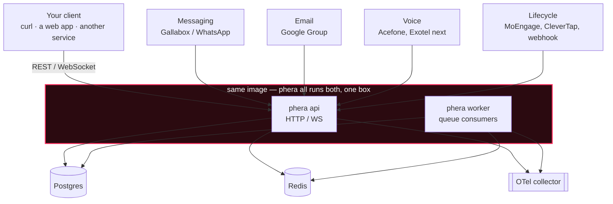
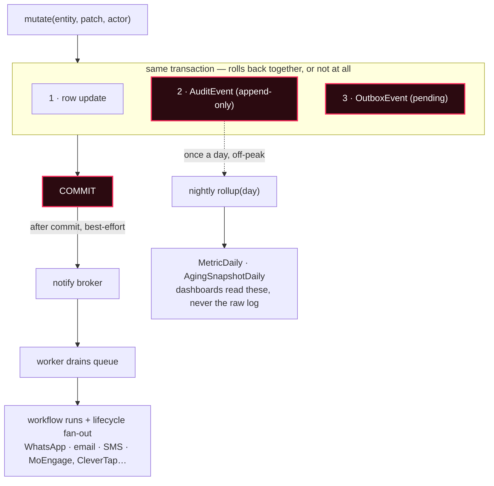

# Phera

**ফেরা — the return.** A headless CRM: configurable funnels, an omnichannel
support inbox, event-driven workflows, and an audit trail that doubles as
your analytics warehouse. No product UI ships in the box — bring your own
client, or drive it from a script.

[](https://github.com/debarko/phera/actions/workflows/ci.yml)
[](https://coderabbit.ai)
[](https://www.python.org/)

**[Read the full walkthrough →](https://debarko.de/products/phera)**

## Why

A CRM is infrastructure, not a seat. Most teams end up with rich operational
software and still no relationship layer: a lead table scoped to one
channel, no support ticketing, a customer's calls/tickets/deals scattered
across tables with nothing tying them together.

The deeper problem: **one person is not one journey.** The same contact can
fill three different forms over three months, each a different commercial
motion run by a different team. Collapsing that onto a single "lead status"
field loses two of the three journeys. Phera keeps the person (`Contact`)
and the journey (`Deal` in a `Pipeline`) as separate records from day one —
a Contact can sit in many funnels at once.

- **Vertical-agnostic core** — no hospital, no e-commerce, no SaaS
  vocabulary baked into the domain model. Map your vertical on top of
  `Contact` / `Pipeline` / `Deal`.
- **Config over code** — funnels, stages, ownership rules and workflows are
  data. Adding one is an admin screen, not a pull request.
- **Pluggable everything** — telephony, email, messaging and lifecycle/CDP
  providers sit behind interfaces. The core never imports a vendor SDK.
- **Audit trail as analytics** — every mutation writes its own history. A
  nightly job folds it into daily metrics. No warehouse, no CDC stream.

## Architecture — same binary, two roles

One image, two commands. `phera api` serves HTTP and WebSocket;
`phera worker` drains queues; `phera all` runs both on a laptop. Scaling
out is more boxes of the same image, never a new microservice. Adapters —
messaging, email, voice, lifecycle — are the only thing that changes per
deployment.



## Every mutation writes its own history

All writes go through one helper. It updates the row, appends an immutable
`AuditEvent` and an `OutboxEvent` in the **same transaction**, then
commits. Nothing is lost if Redis is briefly down — the broker is notified
only after commit, and a dispatcher heals any miss. A nightly job folds the
log into small daily tables, so aging and TAT numbers come from the same
database, not a warehouse.



## Domain model

| Entity | What it is |
|---|---|
| `Contact` | A person. The unified-timeline anchor — not a lead. |
| `Pipeline` | A funnel: named, ordered stages. Admins create these, no deploy. |
| `Stage` | One step in a Pipeline — open, won or lost category, optional SLA. |
| `Deal` | One Contact's membership in one Pipeline. This is the lead. |
| `Ticket` | A support request. One inbox regardless of channel. |
| `Interaction` | Append-only row behind the contact-facing timeline. |
| `AuditEvent` | Immutable record of every mutation — who, what, when, from → to. |
| `Workflow` | A published graph: trigger → conditions → wait/branch → actions. |

Stage lives on the `Deal`, never on the `Contact` — there is no
`Contact.stage`, only a list of Deals, each with its own owner and
position.

## What's in the box

- **Configurable funnels** — Pipelines and stages are admin-owned objects;
  create, clone, reorder without a deploy. One Contact can sit in several
  at once.
- **Omnichannel inbox** — email, WhatsApp and phone normalize into one
  Ticket. One routing engine, one capacity pool, L1 → L2 overflow.
- **Workflow engine** — n8n-style graphs react to domain events and
  time-based waits, executed asynchronously on horizontally scaled workers.
- **Call transcription** — inbound and outbound calls through a connected
  provider are recorded, transcribed, and attached to the contact timeline.
- **Configurable ownership** — contact-centric or pipeline-centric, a
  workspace setting decides who owns what, not a fork of the codebase.

## Quick start

```bash
git clone https://github.com/debarko/phera.git
cd phera

docker compose up -d postgres redis otel-collector
pip install -e ".[dev]"
cp .env.example .env
alembic upgrade head
phera all
```

API: http://localhost:8000/docs
Health: http://localhost:8000/health

## Process roles

| Command | Role |
|---|---|
| `phera api` | HTTP/WS only |
| `phera worker` | Queue consumers |
| `phera all` | API + worker (local dev) |

## Observability

Set `OTEL_EXPORTER_OTLP_ENDPOINT=http://localhost:4318` (default). Traces, metrics, and slow SQL export via OTLP HTTP to any compatible backend (SigNoz, etc.).

## Testing

Tests split into **unit** (no database) and **integration** (ephemeral in-memory SQLite, created and destroyed per test). No Docker, Postgres, or Redis required for CI or nightly runs.

| Command | What it runs |
|---|---|
| `make test` | Unit tests only (default) |
| `make test-unit` | Same as `make test` |
| `make test-integration` | Flow tests with ephemeral SQLite |
| `make test-nightly` | Full suite — unit + integration |
| `make test-cov` | Full suite with coverage report |

```bash
make test              # fast, no DB
make test-nightly      # exhaustive regression suite
```

Unit tests override FastAPI dependencies so no SQL is executed. Integration tests spin up an in-memory SQLite schema per test, exercise real mutate/audit/outbox/form/workflow/routing flows, then drop the schema.

Environment variables used in CI and locally:

```bash
OTEL_ENABLED=0 REDIS_URL=
```

## Auth

Phera authorizes from `X-Actor-*` headers only — no JWT in the service.

## Channels

WhatsApp (Gallabox) and email (Google Group → inbound hook) setup: see [CHANNELS.md](CHANNELS.md).

## Contributing

Issues and pull requests are welcome — read the code, open an issue, send
a PR. `make test` before you push; CI runs the same suite on every PR.
